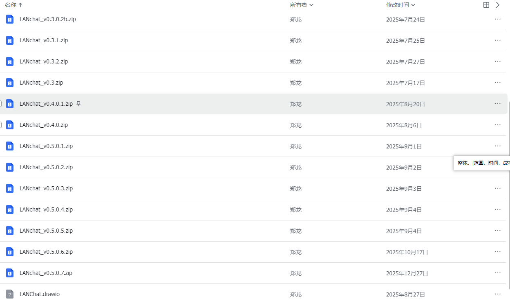
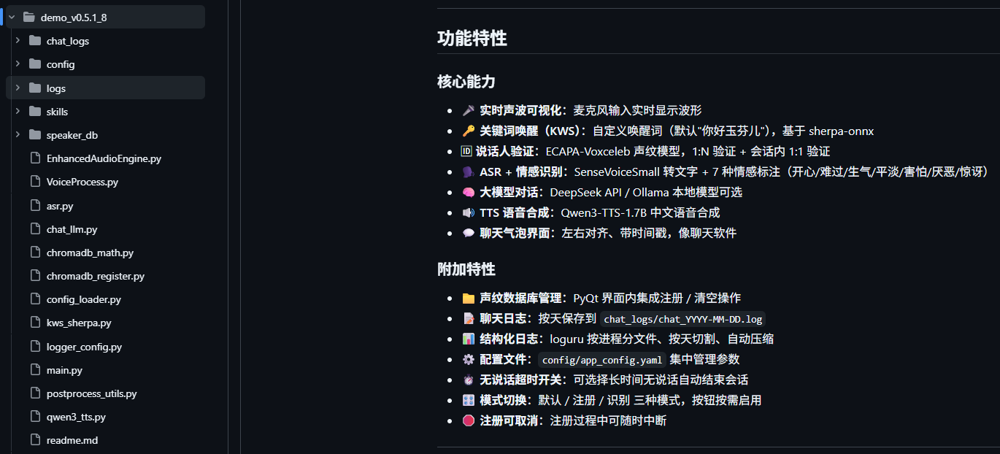
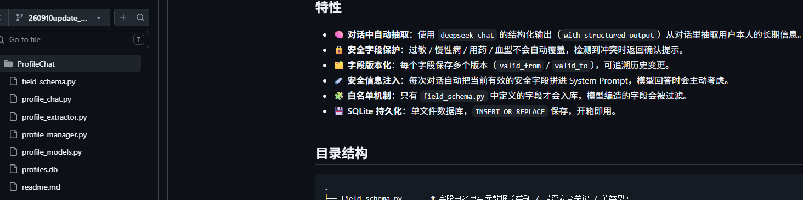
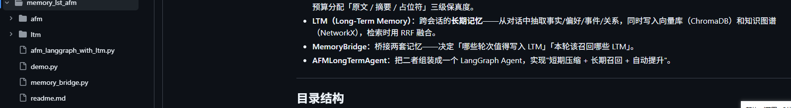
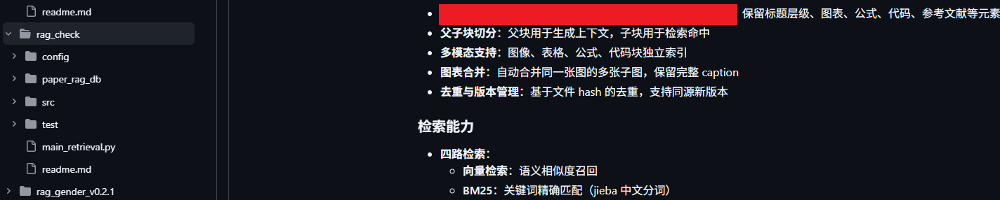
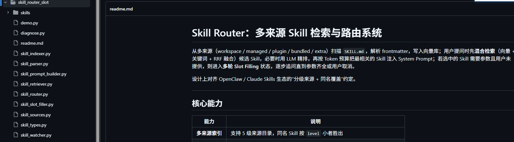

# 2025-12-07
# 介绍
这是LANChat介绍文档仓库，
# 产品概述  
LANChat是一款专为高保密需求场景设计的本地化大语言模型部署平台，搭载NVIDIA Jetson AGX Orin（64GB）边缘计算设备，支持4-7人同时低延迟交互。通过完全离线的模型部署，LANChat确保敏感数据无需上传至云端，彻底杜绝外部泄露风险，确保金融交易、科研机密、企业战略等敏感对话数据无需上传至云端，从根本上杜绝外部泄露风险，为您提供安全与效率兼备的AI对话能力。
> LANChat：安全与智能，无需妥协。
# 功能
包好了如下模块：
- mcp模块
- 模型负载均很
- 超长记忆系统
- 人物肖像系统
- 文件检索知识图谱
- 工作流封装

# 总结
2025年12月开发完成，其实在2025年6月开发完成，就不再添加新技术，12月尝试plan功能，类似于skill。这代更趋向于私人集体使用。
# 2026-10
# 介绍
对LANChat模块进行更新，并加入语音控制系统。开发针对个人使用功能。
# 功能
## 语音控制系统功能
- 唤醒词+身份认证
- asr+情绪分析+身份认真
- 文字转语音  
[演示视频](https://github.com/Salary-only-17k/LANChat_doc/blob/v1.0.2/images/g.mp4)

## 优化长短记忆
- 优化匹配算法
- 优化上下

## 混合rag检索
- 采用混合检索方式检索信息
- 针对英文论文特点开发
- 建立信任机制

## 个人肖像
- 优化

## 添加skiill功能
- 安装下载skill
- 添加slot机制

# 遗留问题
- 各个功能单元经过10条数据测试，很稳定。
- 各个单元没有集成道lanchat中。等下次有时间再去做。
